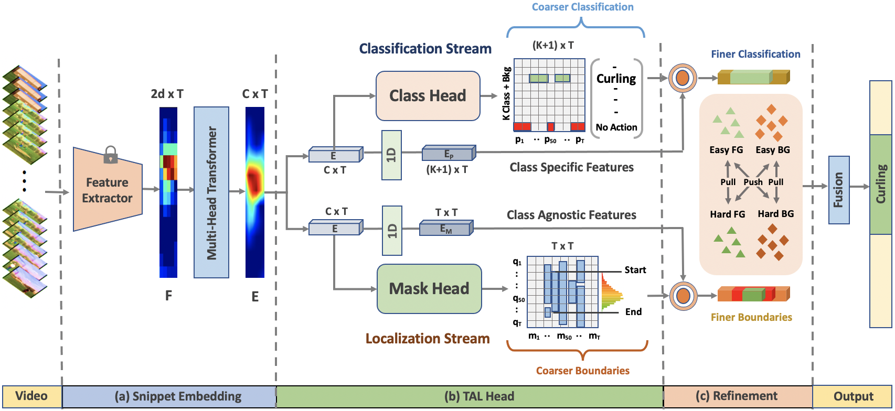
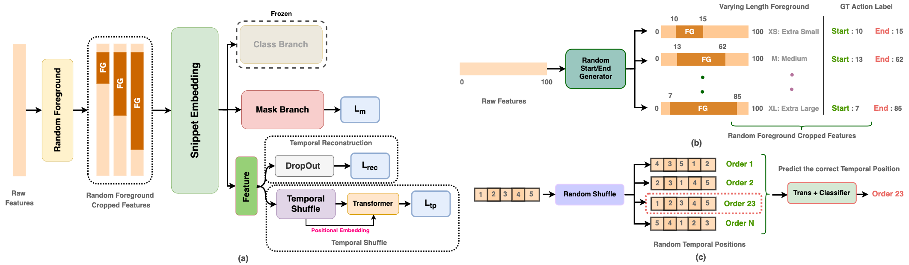

[](https://paperswithcode.com/sota/semi-supervised-action-detection-on?p=semi-supervised-temporal-action-detection)
[](https://paperswithcode.com/sota/semi-supervised-action-detection-on-thumos-14?p=semi-supervised-temporal-action-detection)

<div align="center">

<h1>Semi-Supervised Temporal Action Detection with Proposal-Free Masking</h1>

<div>
    <a href='https://sauradip.github.io/' target='_blank'>Sauradip Nag</a><sup>1,2,+</sup>&emsp;
    <a href='https://scholar.google.co.uk/citations?hl=en&user=ZbA-z1cAAAAJ&view_op=list_works&sortby=pubdate' target='_blank'>Xiatian Zhu</a><sup>1,3</sup>&emsp;
    <a href='https://scholar.google.co.uk/citations?user=irZFP_AAAAAJ&hl=en' target='_blank'>Yi-Zhe Song</a><sup>1,2</sup>&emsp;
    <a href='https://scholar.google.co.uk/citations?hl=en&user=MeS5d4gAAAAJ&view_op=list_works&sortby=pubdate' target='_blank'>Tao Xiang</a><sup>1,2</sup>&emsp;
</div>
<div>
    <sup>1</sup>CVSSP, University of Surrey, UK&emsp;
    <sup>2</sup>iFlyTek-Surrey Joint Research Center on Artificial Intelligence, UK&emsp; <br>
    <sup>3</sup>Surrey Institute for People-Centred Artificial Intelligence, UK
</div>
<div>
    <sup>+</sup>corresponding author
</div>

<h3><strong>Accepted to <a href='https://eccv2022.ecva.net/' target='_blank'>ECCV 2022</a></strong></h3>

<h4 align="center">
  <a href="" target='_blank'>[Project Page]</a> •
  <a href="https://arxiv.org/abs/2207.07059" target='_blank'>[arXiv]</a>
</h4>
<table style="border:none;border-color:white;">
<tr style="border:0px;border-color:white;">
    <td style="border:0px;border-color:white;"></td>
</tr>
</table>
</div>

## Updates

- (June, 2022) We released SPOT training and inference code for ActivityNetv1.3 dataset.
- (June, 2022) SPOT is accepted by ECCV 2022.

## Summary
- First single-stage proposal-free framework for Semi-Supervised Temporal Action Detection (SS-TAD) task.
- Being single-stage, it does not suffers from the notorius Proposal Error Propagation problem.
- Proposed a novel pre-text task for Action Detection based on the notion of Random Foreground.
- A novel Boundary Refinement strategy is proposed based on contrastive learning.
- With just 10% labeled videos majority of the existing TAD approaches are surpassed in terms of performance. 

## Abstract

Existing temporal action detection (TAD) methods rely on a large number of training data with segment-level annotations. Collecting and annotating such a training set is thus highly expensive and unscalable. Semi-supervised TAD (SS-TAD) alleviates this problem by leveraging unlabeled videos freely available at scale. However, SS-TAD is also a much more challenging problem than supervised TAD, and consequently much under-studied. Prior SS-TAD methods directly combine an existing proposal-based TAD method and a SSL method. Due to their sequential localization (e.g, proposal generation) and classification design, they are prone to proposal error propagation. To overcome this limitation, in this work we propose a novel Semi-supervised Temporal action detection model based on PropOsal-free Temporal mask (SPOT) with a parallel localization (mask generation) and classification architecture. Such a novel design effectively eliminates the dependence between localization and classification by cutting off the route for error propagation in-between. We further introduce an interaction mechanism between classification and localization for prediction refinement, and a new pretext task for self-supervised model pre-training. Extensive experiments on two standard benchmarks show that our SPOT outperforms state-of-the-art alternatives, often by a large margin.

## Architecture



## Getting Started

### Requirements
- Python 3.7
- PyTorch == 1.9.0  **(Please make sure your pytorch version is atleast 1.8)**
- NVIDIA GPU
- Kornia


### Environment Setup
It is suggested to create a Conda environment and install the following requirements
```shell script
pip3 install -r requirements.txt
```

### Download Features
Download the video features and update the Video paths/output paths in ``` config/anet.yaml ``` file. For now ActivityNetv1.3 dataset config is available. We are planning to release the code for THUMOS14 dataset soon. 

| Dataset | Feature Backbone | Pre-Training | Link | 
|:---:|:---:|:---:|:---:|
| ActivityNet | TSN | Kinetics-400 | [Google Drive](https://drive.google.com/u/0/uc?id=1ISemndlSDS2FtqQOKL0t3Cjj9yk2yznF&export=download) |
| THUMOS | TSN | Kinetics-400 | [Google Drive](https://drive.google.com/drive/folders/1-19PgCRTTNfy2RWGErvUUlT0_3J-qEb8?usp=sharing) |
| ActivityNet | I3D | Kinetics-400 | [Google Drive](https://drive.google.com/drive/folders/1B1srfie2UWKwaC4-7bo6UItmJoESCUq3?usp=sharing) |
| THUMOS | I3D | Kinetics-400 | [Google Drive](https://drive.google.com/drive/folders/1C4YG01X9IIT1a568wMM8fgm4k4xTC2EQ?usp=sharing) |
 
### Model Training 

To train SPOT from scratch run the following command. The training configurations can be adjusted from  ``` config/anet.yaml ``` file.
This training includes both Pre-training and the fine-tuning stages.
```shell script
python tags_train.py
```
### Model Inference
We provide the pretrained models containing the checkpoint for I3D features on ActivityNetv1.3 . It can be found in the [Link](https://drive.google.com/file/d/1ltF5AKee8JcdJmDPabJtXwJe1_m0X3Sc/view?usp=sharing)

After downloading the checkpoints, the checkpoints path can be saved in ``` config/anet.yaml ``` file.
The model inference can be then performed using the following command 
```shell script
python tags_inference.py
```
### Model Evaluation
To evaluate our TAGS model run the following command. 
```shell script
python eval.py
```

### Performance 


### TO-DO Checklist
- [ ] Support for THUMOS14 dataset
- [ ] Enable multi-gpu training

## Citation
If you find this project useful for your research, please use the following BibTeX entry.
```
@article{nag2022temporal,
  title={Temporal Action Detection with Global Segmentation Mask Learning},
  author={Nag, Sauradip and Zhu, Xiatian and Song, Yi-Zhe and Xiang, Tao},
  journal={arXiv preprint arXiv:2207.06580},
  year={2022}
}
}
```

